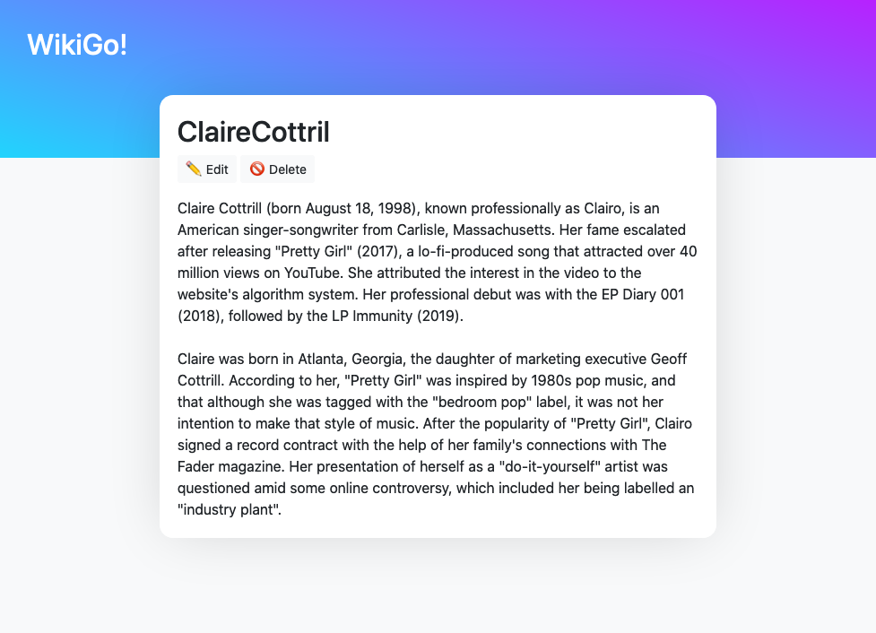

# WikiGo!

Just a simple web app I made to introduce myself into Go web app development, based in the official [Go web apps guide](https://golang.org/doc/articles/wiki/), but improved! Using the amazing [extemplate](https://github.com/dannyvankooten/extemplate) library created by Danny van Kooten, that allows an easy file-based template inheritance, similar to the Blade templating from Laravel.

It also ships with a superb, clean and modern design, using [Bootstrap](https://getbootstrap.com) CSS framework and some custom CSS from [my personal website](https://avalos.me).

It's amazing how easy and convenient is working with Go! I'm planning to replace Laravel with Go in some near future in some of my personal projects.

## Install

To run this project, download this, create a MySQL database called `gowiki`, with username `gowiki` and password `gowiki` and use port `3306` in `localhost` (or modify the hardcoded values in `wiki.go`), cd into the root and run the following commands:

```
$ go build
$ ./gowiki
```

A web server will automatically start at `localhost:8080`, there's no need for extra configuration (except for the MySQL database).

## Screenshots




## Licence

I have absolutely no reason to make this project proprietary, so I'll leave the good ol' GNU GPLv3 licence, so you can make use of this code in your projects:

```
    This program is free software: you can redistribute it and/or modify
    it under the terms of the GNU General Public License as published by
    the Free Software Foundation, either version 3 of the License, or
    (at your option) any later version.

    This program is distributed in the hope that it will be useful,
    but WITHOUT ANY WARRANTY; without even the implied warranty of
    MERCHANTABILITY or FITNESS FOR A PARTICULAR PURPOSE.  See the
    GNU General Public License for more details.

    You should have received a copy of the GNU General Public License
    along with this program.  If not, see <https://www.gnu.org/licenses/>.
```